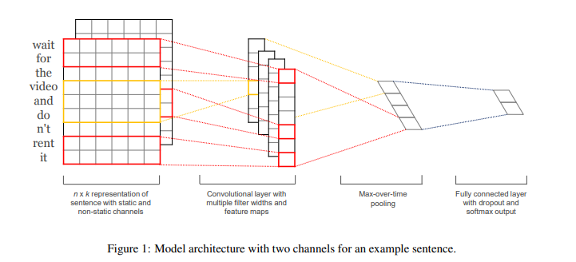

# 本项目为哈尔滨工业大学情感分析与计算实验
本系统主要采用了文本分类的方法，项目由传统神经网络如CNN、RNN等和基于Bert预训练模型的方法构成。  

# 数据集
采用学校老师发放的微博数据集，为json格式，训练集的大小为8000，验证集的大小为2000，测试集大小为3000，格式如下:  
```json
[
  {
    "id": 22,
    "content": "武汉挺[抱抱]",
    "label": "positive"
  },
  {
    "id": 23,
    "content": "[doge][doge][doge][爱你][爱你][爱你]",
    "label": "positive"
  },
  {
    "id": 24,
    "content": "会好起来的???还想去武汉旅游呢！",
    "label": "positive"
  }
]
```
需要数据集请私信xiong257246@outlook.com。  

# 数据预处理
使用基于字向量的随机映射和基于SGNS的词向量映射。


# 实验结果 


|模型|Accuracy|F1-Score|说明|
|:---:|:---:|:---:|:---:|
|CNN|76.25%|0.7412|SGNS+CNN|
|RNN|72.95%|0.7073|SGNS+BiRNN|
|LSTM|73.3%|0.6826|SGNS+BiLSTM|
|Bert|81.5%|0.7941|Bert|


# 实验
## CNN文本分类
### CNN文本分类内容
CNN文本分类的实验部分主要参考Kim在2014年的Convolutional Neural Networks for Sentence Classification 论文，
模型结构如Figure 1所示。  
  
CNN的模型主要由四层组成：  
<ol>
<li>第一层：Embedding层，将每个字或词映射为一个词向量。</li>
<li>第二层：卷积层，使用256个卷积核，识别不同的模式。</li>
<li>第三层：池化层。</li>
<li>第四层：全连接层，将结果映射到分类。</li>
</ol>

### CNN文本分类实验结果
本部分基于词的粒度、字的粒度进行词嵌入。  
使用基于字的粒度时，CNN的精度为70%左右；  
使用基于SGNS预训练的embedding模型时，以词为粒度，精度为75.45%左右，相较于字粒度随机化embedding的方式， 提升了大约5%左右的精度。      

|模型|Accuracy|F1-Score|
|:---:|:---:|:---:|  
|CNN|72.3%|0.6988|
|SGNS+CNN|76.25%|0.7412|  


## RNN文本分类
训练时长:4.923min  
本部分基于词的粒度、字的粒度进行词嵌入。  
使用基于字的粒度时，BiRNN的精度为%，f1-score为。    
使用基于词的粒度时，BiRNN的精度为72.95%，f1-score为0.7073。  

|模型|Accuracy|F1-Score|  
|:---:|:---:|:---:|  
|BiRNN|61.3%|0.5390|
|SGNS+BiRNN|72.95%|0.7073|  

## LSTM文本分类
训练时长:5.405min  
本部分基于词的粒度、字的粒度进行词嵌入。  
使用基于字的粒度时，BiLSTM的精度为71.55%，f1-score为0.6826。    
使用基于词的粒度时，BiLSTM的精度为73.30%，f1-score为0.7116。  

|模型|Accuracy|F1-Score|  
|:---:|:---:|:---:|  
|BiLSTM|71.15%|0.6826|
|SGNS+BiLSTM|73.05%|0.7116|  

## 基于Bert预训练模型

|模型|Accuracy|F1-Score|  
|:---:|:---:|:---:|  
|Bert|81.5%|0.7941|


# 致谢    
部分内容参考  
[Chinese-Text-Classification-Pytorch](https://github.com/649453932/Chinese-Text-Classification-Pytorch)  
[Bert-Chinese-Text-Classification-Pytorch](https://github.com/649453932/Bert-Chinese-Text-Classification-Pytorch)  
[Chinese-Word-Vectors](https://github.com/Embedding/Chinese-Word-Vectors)

# 参考文献
[1] Convolutional Neural Networks for Sentence Classification  
[2] BERT: Pre-training of Deep Bidirectional Transformers for Language Understanding  


